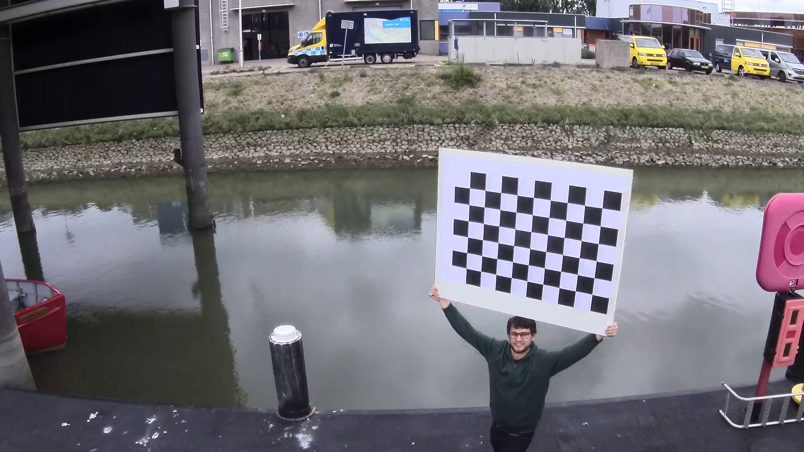

Persoonlijke portfolio voor de minor Applied Data Science op de Haagse Hogeschool.  

|Student:  |Job Vink|
| ---: | :--- |
|Studentnummer:| <b>17170974</b>|
|Groep:| <b>KB-74 Shipping</b>|
|Opdrachtgever:| <b>Port of Rotterdam</b>|

# Inhoudsopgave
|Hoofdstuk        |Notebook           | 
|------             |:------|
|[Introduction](https://github.com/KB-74/portfolio/blob/master/Job/portfolio.md#Introduction)             | - |
|[Domain Knowledge](https://github.com/KB-74/portfolio/blob/master/Job/portfolio.md#Domain-Knowledge)     | - |
|[Courses](https://github.com/KB-74/portfolio/blob/master/Job/portfolio.md#Courses)                       | - |
|[Predictive Models](https://github.com/KB-74/portfolio/blob/master/Job/portfolio.md#Predictive-Models)   | [pixel_walker](notebooks/pixel_walker.ipynb) |
|[Data Collection](https://github.com/KB-74/portfolio/blob/master/Job/portfolio.md#Data-Collection)       | [video_extractor](notebooks/video_extractor.ipynb) |
|[Data Preparation](https://github.com/KB-74/portfolio/blob/master/Job/portfolio.md#Data-Preparation)     | [fisheye_configuration](notebooks/fisheye_configuration.ipynb) & [fish_eye_undistord](notebooks/fish_eye_undistord.ipynb) |
|[Data Visualization](https://github.com/KB-74/portfolio/blob/master/Job/portfolio.md#Data-Visualization) | - |
|[Evaluation](https://github.com/KB-74/portfolio/blob/master/Job/portfolio.md#Evaluation)                 | [algoritme_evaluation](notebooks/algoritme_evaluation.ipynb) |
|[Diagnostics](https://github.com/KB-74/portfolio/blob/master/Job/portfolio.md#Diagnostics)               | - |
|[Communication](https://github.com/KB-74/portfolio/blob/master/Job/portfolio.md#Communication)           | - |

# Introductie

FLOAT YOUR IDEA. Betekent letterlijk: het uittesten van een idee. Maar met het Floating Lab Rotterdam laten we ideeën en innovaties ook nog daadwerkelijk drijven. Samen met marktpartijen, overheden, onderwijsinstellingen én onderzoeksinstituten bouwen we aan een kennisnetwerk rond Smart Shipping en bieden we de mogelijkheid ideeën eenvoudig en veilig te testen.

<p align="center"> </p>

Ik heb uiteindelijk voor de shipping groep gekozen om de volgende redenen:	
- Het project leek mij uitermate interessant vanwege het belang dat autonoom varen in de toekomst zal gaan maken.	
- Het klikte vrijwel gelijk tussen de andere projectleden van de shipment groep.	
- De shipment groep had nog niemand die op het moment een ict studie deed. 	
- Bij dit project werken we samen met meerdere stakeholders (Poort of Rotterdam, CGI en Captain AI). Ik wilde graag leren hoe je hier het beste mee om kan gaan.

# Domain Knowledge
Aan het begin van de minor zijn we samen met Port of Rotterdam en CGI naar het SMASH event gegaan dat gericht is op smart shipping.
Hier kregen we interressante onderwerpen gepitched en hebben we met andere organisaties nagedacht over het toekomst beeld 
van smartshipping en autonoom varen gehad.
Een van de pitches die mij het meest aansprak was van Novimar die booten in een vessel train wilde laten varen. 
Bij dit concept is er een hoofdship die voorop vaart in een reeks van boten. Dit ship is verantwoordelijk voor 
de navigatie en de schepen in de reeks varen autonoom achter dit ship aan tot ze de vessel train verlaten.

# Courses
Aan het begin van de minor had ik al eenige python kennis. Om deze kennis weer even bij te werken en op te frissen ben ik 
net als de andere uit mijn groepje begonnen met de cources van datacamp en coursera. 

### datacamp


### coursera


# Predictive Models
Omde kade te kunnen herkennen met een algoritme wordt er gebruik gemaakt
van een zogenaamde ’pixel walker’. Dit is een algoritme dat vanaf een voorgedefinieerd
startpunt over de betreffende frame heen scant in een voorgedefinieerde
richting. In dit proces wordt de waarde van de kleur gemeten van
een pixel en vergeleken met elke vorige stap die genomen wordt. Het verschil
wordt gemeten aan de hand van de Euclidian distance. De volgende stap
die het algoritme neemt, is het vergelijken van de Euclidian distance met het
startpunt. Als deze te veel afwijkt, definieert het algoritme dat punt als een
scheiding tussen land en water. De pixel walkers wordt vanuit het startpunt
verschillende richtingen opgestuurd. Doordat de pixel walker verschillende
richtingen opgaat kan het kleine objecten op het water ontwijken en de werkelijke
scheiding tussen water en land vinden. Het deel van dit algoritme dat deze taak uitvoert heb ik in dit [notebook](notebooks/pixel_walker.ipynb) opgenomen.

# Data collection
De aangeleverde data van Port of Rotterdam kwam als mp4 formaat. Omdat dit formaat soms lastig is om mee te werken als je aan het ontwikkelen bent.
Hebben we er voor gekozen om een aantal frames out het filmpje te halen en deze op te slaan als png. 
Hiervoor heb ik een frame extraction script geschreven die ik opgenomen heb in het volgende notebook. Het script gaat door 
de hele video, kan de bolling van de vishoek er uit halen en slaat elke duizenste frame op als png.   

# Data preparation
De camerabeelden van de boot worden gefilmd met een fisheye camera, dit zorgt ervoor dat de beelden verstoord worden met een ronding.
Deze verstoring kunnen uit het beeld gehaald worden met behulp van de opencv libary.
Deze biblotheek heeft hier wel een bepaalde configuratie voor nodig omdat verschillende camera’s verschillende 
kijkhoeken hebben waarin ze filmen. Deze configuratie kun je ook door opencv laten berekenen. Hiervoor heb je een 
groot bord met een schaakpatroon nodig.



afbeelding 1: (schaakboard patroon)

Ik heb het script dat ik gemaakt heb om deze configuratie te krijgen opengenomen in een [notebook](notebooks/fisheye_configuration.ipynb). Uit dit script kwamen 
de volgende waardes:

```python
DIM = (1920, 1080)

K = [[1339.2898532184101, 0.0, 912.605852159453],
     [0.0, 1334.6227716562116, 540.699525078661],
     [0.0, 0.0, 1.0]]
    
D = [[-0.019105044374337198], 
     [0.26447332249046934], 
     [-0.7164055812838268], 
     [0.6830070634869604]]
```

Met behulp van deze parameters konden we de verstooring uit het beeld filteren. Ook hiervoor heb ik een [notebook](notebooks/fisheye_undistord.ipynb) aangemaakt.


afbeelding 2: (vervormd beeld)


afbeelding 3: (ontvormd beeld)

# Data Visualization

## Evaluation
Het doel van het algoritme is om aan te geven waar water is en waar geen water is. We kunnen het model daarmee evalueren
door te kijken hoeveel pixels goed zijn geindenitficeerd als water en hoeveel pixels fout zijn geindentificeerd als water.
Hiervoor hebben we wel een aantal frames nodig, we hebben er voor gekozen om 250 frames zelf handmatig te labelen om ons
algoritme mee te evalueren.

Ik heb een deel van de code om het algoritme te evalueren opgenomen in een jupyter notebook.

De notebook bekijkt het volgende voorbeeld:

En geeft de volgende output:
```
True Positives:     2037054
False Positives:    56664
False Negatives:    3
True Negatives:     4127079
```
De notebook output een confucion matrix van een bepaalde frame. Om ons algoritme goed te evalueren hebben we het script 
gedraait over allen 250 frames

# Communication (presentations, summaries, paper, ...)
Zelf ben ik voornamelijk bezig geweest met het technische gedeelte van het project. Dat stelde mij wel in staat om goed uit mijn
woorden te komen tijdens de presentaties en me te kunnen verantwoorden bij de vragen achteraf.

## presentaties

* [Week 13](https://github.com/KB-74/portfolio/blob/master/Presentaties/Presentation_Sprint_13.pptx), Gepresenteerd door Job en Michiel.
* [Week 14](https://github.com/KB-74/portfolio/blob/master/Presentaties/Presentation_Sprint_14.pptx), Gepresenteerd door Job en Michiel.
* [Week 15](https://github.com/KB-74/portfolio/blob/master/Presentaties/Presentation_Sprint_15.pptx), Gepresenteerd door Job en Michiel.
