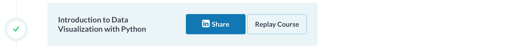
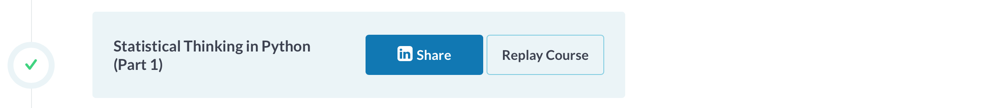

# Portfolio
Het persoonlijk portfolio voor de minor Data Science 2018/2019 op de Haagse hogeschool.

|  | |
| ---: | :--- |
|Student:| <b>Martin de Rijke</b>|
|Studentnummer:| <b>18098568</b>|
|Groep:| <b>KB-74 Shipping</b>|
|Opdrachtgever:| <b>Port of Rotterdam</b>|
|Begeleider:| <b>Hugo Benne</b>|

# Reading Guide
In dit portfolio zijn de resultaten beschreven die behaald zijn door mijzelf binnen het SHIP project. 
Het doel is om een duidelijke weergave te geven van hetgeen dat ik geleerd heb van het onderwerp Data Science. 
Dankzij die reden is dit portfolio ook opgedeeld in een structuur die de verschillende belangrijke aspecten van Data Science weergeeft. 
Onder elk kopje is een stuk tekst uitgewerkt met daarin de resultaten die ik heb behaald heb kort beschreven. 
Vervolgens is er een link of afbeelding toegevoegd met het bewijs van het behalen van dat resultaat. 
Binnen het project SHIP zijn niet alle onderdelen van Data Science heel goed boven gekomen of heb ik niet deelgenomen aan het werken aan dat specifieke onderdeel. 
Daar heb ik wel over geleerd in de lessen in in de online courses. Verder heb ik zelf ook alle stappen doorlopen op een dataset, maar dat levert geen toegevoegde waarde
voor dit portfolio, aangezien ik niet het bewijs kan leveren, dat ik het zelf gemaakt heb. 
In dit portfolio heb ik zo min mogelijk zaken gezet die ook in de paper naar voren komen, zoals uitleg over het project, of in algemene zin het product
dat we ontwikkeld hebben. Dit naar aanleiding van de feedback les op het portfolio. Dit gaat puur om persoonlijk resultaat en laten zien dat ik op een bepaald level ben als 'data scientist'.
Gedurende de feedbackles van het portfolio is er vermeld dat de 5 meest ingewikkelde stukken code meegenomen moesten worden in het portfolio.
Dat heb ik ook gedaan. Tijdens het project heb ik nog een stuk meer code geschreven, maar ik denk dat de 5 stukken in dit portfolio mijn niveau goed weergeven.

# Inhoudsopgave

|Hoofdstuk        |Codebook           | Afgerond | 
|------             |:------| ---- |
|[Introduction](https://github.com/KB-74/portfolio/blob/master/Martin/portfolio_martin_de_rijke.md#Introduction)             | - |✓| 
|[Courses](https://github.com/KB-74/portfolio/blob/master/Martin/portfolio_martin_de_rijke.md#Courses)                       | - |✓|
|[Domain Knowledge](https://github.com/KB-74/portfolio/blob/master/Martin/portfolio_martin_de_rijke.md#Domain-Knowledge)     | - |✓|
|[Predictive Models](https://github.com/KB-74/portfolio/blob/master/Martin/portfolio_martin_de_rijke.md#Predictive-Models)   |[pixel_walker_v5 notebook](https://github.com/KB-74/portfolio/blob/master/Martin/resources/pixel_walker_v5.ipynb)|✓| 
|[Data Preparation](https://github.com/KB-74/portfolio/blob/master/Martin/portfolio_martin_de_rijke.md#Data-Preparation)     |[black&white_or_rgb_notebook](https://github.com/KB-74/portfolio/blob/master/Martin/resources/black&white_or_rgb.ipynb)|✓| 
|[Data Visualization](https://github.com/KB-74/portfolio/blob/master/Martin/portfolio_martin_de_rijke.md#Data-Visualization) |[overlay_checker_notebook](https://github.com/KB-74/portfolio/blob/master/Martin/resources/overlay_checker.ipynb)|✓|
|[Data Collection](https://github.com/KB-74/portfolio/blob/master/Martin/portfolio_martin_de_rijke.md#Data-Collection)       |[wall_labeler_notebook](https://github.com/KB-74/portfolio/blob/master/Martin/resources/wall_labeler.ipynb)|✓|
|[Evaluation](https://github.com/KB-74/portfolio/blob/master/Martin/portfolio_martin_de_rijke.md#Evaluation)                 |[frame_checker_notebook](https://github.com/KB-74/portfolio/blob/master/Martin/resources/frame_checker.ipynb)|✓|
|[Diagnostics](https://github.com/KB-74/portfolio/blob/master/Martin/portfolio_martin_de_rijke.md#Diagnostics)               | - |✓|
|[Communication](https://github.com/KB-74/portfolio/blob/master/Martin/portfolio_martin_de_rijke.md#Communication)           | - |✓|
|[Conclusie](https://github.com/KB-74/portfolio/blob/master/Martin/portfolio_martin_de_rijke.md#Conclusie)                   | - |✓|

# Introduction 

Mijn keuze voor het project SHIP is gebaseerd op onderstaande redenen:
- SHIP gaat om leading edge technology, autonome mobiliteit is op dit moment heel erg populair en daar wil
ik meer over leren. 
- Verder dacht ik dat dit 1 van de meest uitdagende projecten was en mijn doel was om mezelf in het 
diepe te gooien en zoveel mogelijk te leren van de minor. 
- Verder vond ik het reizen naar Rotterdam en het hebben van zoveel stakeholders heel interessant,
omdat dit ook inzichten geeft in belangen en project management met meerdere partijen.
- De scheepvaart is ook iets wat mij aanspreekt. Ik wil meer leren over hoe de haven van 
Rotterdam werkt en hoe de trend Smart Shipping zich ontwikkeld.
- Ten slotte vind ik machine learning en deep learning zeer interessant en dat komt in dit project
naar voren.

# Courses
Binnen de minor waren er twee courses verplicht. De Machine Learning course van Coursera week 1-3 + 6 en een aantal Python courses op DataCamp. 

### Coursera Course
Coursera is een online platform dat courses aanbiedt. Voor de minor waren de studenten verplicht om deel te nemen aan de machine learning course.
Uiteraard heb ik dat ook gedaan en week 1-3 en 6 succesvol afgerond. In afbeelding 1 is het bewijs daarvan terug te vinden. 

afbeelding 1: (Bewijs afronding week 1-3 + 6 Coursera)

### DataCamp
Datacamp is een platform waarop programmeren op een interactieve manier kan worden aangeleerd.
Ik heb het gebruikt om Python te leren. Er was een speciale omgeving ingericht genaamd de 'Data Scientist Track'.
Vanuit de minor waren niet alle onderdelen verplicht. Uiteindelijk heb ik 13 weken afgerond. Een stuk meer dan vereist voor het afsluiten van de minor.
In afbeelding 2 het bewijs daarvan. 

afbeelding 2: (DataCamp All Courses Completed)

# Domain Knowledge
Het halen van het tentamen met een 7,2 is het voornaamste bewijs van het bezitten van de benodigde domein kennis. Verder heb ik in de bovenstaande afgeronde courses ook kennis opgedaan.
Dit is vooral theoretische kennis. In het project zelf heb ik de praktische kennis opgedaan. De voornaamste voorbeelden daarvan staan in de onderstaande hoofdstukken van dit portfolio.

# Predictive Models
Ons algoritme zoals beschreven in de paper. (Land/water algoritme) is op conceptueel niveau door mij bedacht. Daarna is hij als groep uitgewerkt. Zelf heb ik ook aan delen meegewerkt.
De eerste versies van het algoritme heb ik samen met Job geschreven. In de onderstaande notebook (pixel_walker_v5 notebook) is de output van het algoritme te zien met de bijbehorende code.
Het algoritme neemt de gemiddelde waarde van de rode lijn en schiet vervolgens pixel walkers die over de afbeelding gaan. Zodra de gemiddelde pixel waarde buiten een bepaalde treshold valt
die gebaseerd is op de Euclidian Distance wordt er een gekleurd puntje gezet. Dit is de scheiding tussen het water en het land.

[pixel_walker_v5 notebook](https://github.com/KB-74/portfolio/blob/master/Martin/resources/pixel_walker_v5.ipynb) 

Na deze versie zijn er meer geoptimaliseerdere versies gebouwd met meer toepassingen. Daar heb ik wel aan meegewerkt, maar daar was mijn impact minder.
Tot en met versie 5 heb ik meer dan 50% van het algoritme bedacht en gebouwd.

# Data Preparation
In het begin stadium van het project heb ik de ontvangen frames van Port of Rotterdam gevisualiseerd en ermee getest. 
De eerste vraag die we hadden was of we gebruik gingen maken van Zwart/Wit of RGB. 
Het gebruik maken van zwart/wit is het meest gunstig aangezien het minder rekenkracht nodig heeft dan RGB.
Ik heb de frames met Python gevisualiseerd en getest. Ik kwam erachter dat zwart/wit niet werkte aangezien er soms boten waren 
of andere objecten op het water die een bijna dezelfde zwart/wit waarde hadden als het water zelf.
RGB werkte in die gevallen wel als er gebruik werd gemaakt van de Euclidian Distance om het verschil te bepalen. Er is dus besloten om daarmee te beginnen. 
In de onderstaande notebook (black&white_or_rgb_notebook) staan allereerst Black&White en RGB uitgewerkt aan de hand van de mean. Daar is echter in beide gevallen geen significant verschil tussen de zee en het schip.
Als de Euclidian Distance wordt gebruikt, is er wel een significant verschil tussen de zee en het schip. Er is dus besloten om die te gebruiken.

[black&white_or_rgb_notebook](https://github.com/KB-74/portfolio/blob/master/Martin/resources/black&white_or_rgb.ipynb)

# Data Visualization
Tijdens het project heb ik veel data gevisualiseerd. Vooral tijdens de DataCamp courses kwam dit veel voor.
De moeilijkheidsgraad daarvan is echter laag. Michiel van Soest en ik hebben wel een Python programma geschreven die twee afbeeldingen over elkaar heen plot.
Dit werd gebruikt om te checken of de data wel of niet correct is gelabeled door het algoritme.
Hetgeen het algoritme had aangegeven als water werd dus geplot als wit en de rest als zwart. Met een 'alpha' van 0.2, zodat het zichtbaar was.
Vervolgens kan een persoon dan bepalen of de gelabelde data wel of niet correct is.

De code kan niet helemaal uitgevoerd worden in Jupyter, aangezien we gebruik hebben gemaakt van verschillende classes in PyCharm.
De notebook (overlay_checker_notebook) bewijst wel dat de code werkt, aangezien er geen error komt en de output geeft ook aan dat hij de twee afbeeldingen over elkaar heen zou plotten.
Ik heb de code ook uitgevoerd in PyCharm en de uitkomende afbeelding (3) toegevoegd. De afbeelding geplot over de afbeelding genomen door een camera op de RPA 3 is geen uitkomst uit het algoritme, maar een random afbeelding van internet.
Er is parallel gewerkt en het algoritme had nog geen output filters die gebruikt konden worden voor dit programma.

[overlay_checker_notebook](https://github.com/KB-74/portfolio/blob/master/Martin/resources/overlay_checker.ipynb)

afbeelding 3: (Overlay Checker Image)

# Data Collection
Er is geen nieuwe data voor het algoritme verzameld tijdens het project. Er is echter wel data gelabeled, zodat er data ontstond voor het neurale netwerk.
Deze data kwam voort uit de niet goed gelabelde data door het algoritme. Alle wel goed gelabelde data, kon direct gebruikt worden. Zo hebben we als groep veel tijd
bespaard door het laten labelen van data door het algoritme.
Met deze tool kunnen er rode puntjes gezet worden bij de scheiding tussen water en land. Dat is ook geillustreerd in de onderstaande afbeelding. De coordinaten van die rode puntjes worden opgeslagen en kunnen vervolgens worden gebruikt om
definitief te bepalen waar water is en waar land, op dezelfde manier als het algoritme dat op dit moment doet.
De notebook (wall_labeler_notebook) werkt niet in Jupyter en wel in PyCharm, ook omdat er gebruik gemaakt wordt van classes. Ik heb een afbeelding (4) toegevoegd waarin de rode puntjes geplaatst zijn door mijzelf met de muis dankzij het programma. Vervolgens ook een screenshot (afbeelding 5) van de code in Pycharm met de 
coördinaten die ik aangevinkt heb als output en ten slotte het notebook (wall_labeler_notebook) in Jupyter, zodat u de code kunt inzien.

[wall_labeler_notebook](https://github.com/KB-74/portfolio/blob/master/Martin/resources/wall_labeler.ipynb)

afbeelding 4: (wall_labeler: Bepaling van de water/land scheiding)

afbeelding 5: (wall_labeler: Bewijs dat de code werkt, dankzij de output)

# Evaluation
Samen met Michiel heb ik een tool ontwikkeld waarmee de gelabelde data die uit het land/water herkennings algoritme komt geverifieerd kan worden. De gelabelde frames worden 1 voor 1 ingeladen en als een frame goed is kan de gebruiker op Y klikken en als hij niet goed is op N. Zo wordt de correct gelabelde data gefilterd voor het neurale netwerk en kan de niet correct gelabelde data handmatig correct gelabeld worden. Zo kan er gelijk onderzocht worden welk % van het totaal aantal frames correct gelabeld zijn door het algoritme. 
Dit (frame_checker_notebook) is een programma dat een frame opent in een nieuw venster, vervolgens kan de gebruiker klikken op 'y' om het frame als goed te bestempelen of op 'n' om hem als niet goed te bestempelen.
De frames worden dan in aparte mappen opgeslagen. De goed gelabelde data kan direct gebruikt worden voor het neurale netwerk en de niet goed gelabelde data kan opnieuw handmatig gelabeled worden.
De notebook (frame_checker_notebook) werkt niet in Jupyter, aangezien er gewerkt is met Classes in PyCharm. De code is wel toegevoegd.
Daaronder twee afbeeldingen, in de eerste afbeelding (6) is het programma nog niet gerund en staan er dus geen afbeeldingen opgeslagen in de twee mappen: 'frames_goed' en 'frames_fout'.
Op de tweede afbeelding (7) is het programma wel gerund, direct erna (te zien aan de tijd, dag en de output) waarin ik een aantal keer op 'y' heb geklikt en een aantal keer op 'n', waardoor de afbeeldingen in de verschillende mappen zijn opgeslagen.
Met deze tool konden we heel makkelijk data beoordelen op wel of niet goed gelabeld door het algoritme.

[frame_checker_notebook](https://github.com/KB-74/portfolio/blob/master/Martin/resources/frame_checker.ipynb)

afbeelding 6: (frame_checker: De twee lege mappen: 'frames_goed' en 'frames_fout' links in beeld)

afbeelding 7: (frame_checker: De opgeslagen frames links in de twee mappen 'frames_goed' en 'frames_fout' opgeslagen)

# Diagnostics
Aan het stukje diagnostics heb ik niet gewerkt tijdens dit project, dat hebben andere groepsleden gedaan. Uiteraard heb ik wel de kennis ervoor opgedaan in de courses en de lessen.
Ik heb voor mezelf ook een dataset van internet gedownload en daar alle stappen op doorlopen. Ik heb echter van meneer Vuurens begrepen, dat het geen meerwaarde heeft voor het portfolio aangezien ik alles van internet had kunnen kopiëren.
Dat heb ik niet gedaan, aangezien ik ervan wilde leren, maar dat kan ik natuurlijk niet bewijzen.

# Communication (presentations, summaries, paper, ...)
Tijdens het project was ik de contactpersoon voor buitenaf. Dat houdt in dat ik contact hield met de opdrachtgever(s), CGI en Port of Rotterdam.
Ik heb niet alleen veel technische skills opgedaan, maar ook soft skills. De twee uniekste voorbeelden hiervan zijn dat ik een interview heb gehad met BNR radio en 
dat ik heb gepresenteerd op de Tommie Awards in Amsterdam.

### Scrum 
Om dit project succesvol te laten zijn is er met de SCRUM methode gewerkt. Er is besloten om dit op een fysiek bord te doen. Met de project aanpak methode van scrum focussen we ons vooral op een werkend product en niet zozeer op documentatie. Bij het scrum proces staan 4 regels centraal:  
- Individu en interactie staat boven het proces en de tools.  
- Working- product over uitgebreide documentatie.  
- Samenwerken met klanten over onderhandelingscontracten.  
- Niet werken met een vooraf opgesteld plan van aanpak, maar agile werken en dus continu het plan veranderen.

### Sprint presentaties
In totaal heb ik 3 presentaties gedaan gedurende het project. Voor de presentatie in week 6 heb ik de opdrachtgever Port of Rotterdam uitgenodigd.
Lukas de Bruijn en Ton van der Weele zijn beide aanwezig geweest.

|  | | |
| ---: | :--- | :--- | 
|<b>Week</b>| <b>Link</b>|<b>Medestudent</b>|
|1| [Presentatie Sprint 1](https://github.com/KB-74/portfolio/blob/master/Presentaties/Presentation_Sprint_1.pptx)| Jasper Vlaar |
|2| [Presentatie Sprint 2](https://github.com/KB-74/portfolio/blob/master/Presentaties/Presentation_Sprint_2.pptx)| - |
|6| [Presentatie Sprint 6](https://github.com/KB-74/portfolio/blob/master/Presentaties/Presentation_Sprint_6.pptx)| Michiel van Soest |

### Wekelijkse Vergaderingen
Elke Donderdag was er een vergadering met de opdrachtgever. Wij als groep bespraken de voortgang en kregen nieuwe input om door te bouwen aan het algoritme en de andere stukken code.
Ik heb de vergaderingen soms geleidt en leerde om effectief te communiceren en verantwoording af te leggen.
Dit dwong ons ook om wekelijks vooruitgang te boeken en nieuwe resultaten te laten zien en dat deden we ook.

### BNR Interview
Één van mijn hoogtepunten was 4 Oktober, toen was er een Innovation Expo in Rotterdam.
Hier ben ik geinterviewed door BNR radio en het is vervolgens de week erna uitgezonden. 
Port of Rotterdam heeft hier zeer positief op gereageerd, aangezien positieve media aandacht goed is voor hun als bedrijf.
Verder was het een unieke en leerzame ervaring. Afbeelding 8 is een foto van het interview.

De link naar het interview: [BNR Radio Interview](https://www.bnr.nl/programmas/wetenschap-vandaag/10356983/elektrisch-vliegen-en-autonoom-varen) (Vanaf minuut 8)

afbeelding 8: (Interview BNR Radio)

### Tommie Awards
Een tweede hoogtepunt was het pitchen in de finales van de Tommie Awards. Het 'floating lab' was geselecteerd voor de prijs:
'Most enabling innovative ecosysteem'. Port of Rotterdam vroeg mij, mede dankzij het succesvolle radiointerview, om te pitchen tijdens de finale.
Dat heb ik uiteraard gedaan. Vervolgens was er een prijs uitreiking tijdens een diner. Hier heb ik met een aantal succesvolle mensen uit het bedrijfsleven gepraat
en een jurylid heeft mij zelfs een baan aangeboden. Helaas hebben we de prijs niet gewonnen, maar het was een extreem leerzame ervaring en een geweldige dag.
Afbeelding 9 is foto genomen tijdens de avond van de Tommie Awards.

afbeelding 9: (Tommie Awards)

### Innovation Expo
Op 4 Oktober vond er een innovatie expo plaats in Rotterdam. Hier hebben wij als groep gepresenteerd.
Op dat moment waren we ook nog druk bezig met opject herkenning, iets dat we later hebben laten vallen wegens tijdsgebrek.
Hier hebben we met allerlei mensen gepraat, een demo gegeven van ons land/water algoritme en van object herkenning en heb ik dus het BNR interview afgegeven.
Afbeelding 10 is genomen tijdens de Innovation Expo om onze demo te demonstreren.

afbeelding 10: (Demo Innovation Expo)

# Conclusie
Tijdens de minor heb ik mezelf enorm ontwikkeld qua programmeer skills. Ik kwam binnen als leek, die nog nooit iets geprogrammeerd had. Ik wist bijvoorbeeld niet wat een string was of het 'print' command.
Op dit moment kan ik programmeren met functies, for loops, while loops en in verschillende classes. Ik heb vooral geleerd dat effectief zoeken op internet en dingen combineren een sleutel zijn in programmeren.
Daarnaast heb ik ook twee unieke kansen gekregen, die weinig studenten krijgen. Daarmee doel ik op het radio interview en de pitch bij de Tommie awards.
Ik heb van de lessen ook veel geleerd. Ik heb kennis gemaakt met linear regression en classification door middel van machine learning en deep learning oftewel neural networks. 
Persoonlijk ben ik meer een alpha dan een beta, maar deze minor was een goede stap uit mijn comfort zone. Ik zie veel kansen voor de toepassing van machine learning en neural networks in de wereld en ik zou zulke projecten
in de toekomst graag begeleiden. 

