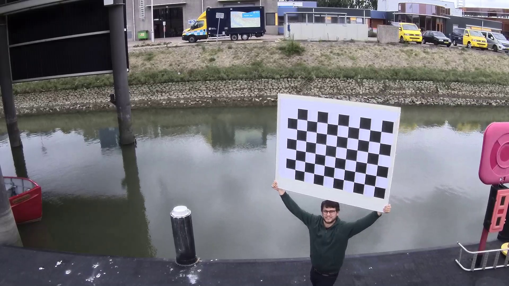
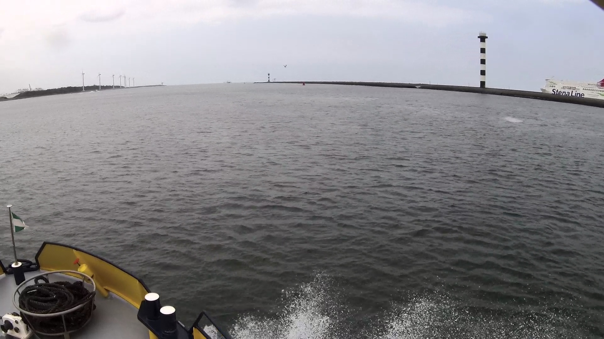
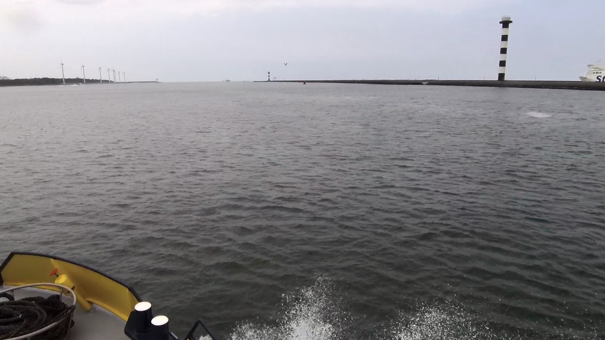

# Courses
# Domain Knowledge
# Predictive Models
# Data preparation
# Data Visualization
# Data collection
# Evaluation
# Diagnostics of the learning process
# Communication (presentations, summaries, paper, ...)

# Kade herkenning
Een van de doelen van dit project is om op camera beelden te herkennen waar gevaren kan worden en waar zich de kade bevind.
Het algoritme dat wij ontwikkeld hebben detecteerd het water op basis van een vaste set met regels. 

## Model
Het algoritme is in drie stappen opgeboud: edge detection, point filtering en kade plotting.

### stap 1
In de eerste stap proberen we te bepalen waar mogelijk de kade zich bevind. Dit doen we op basis van de euclidean distance tussen pixels.


### stap 2


### stap 3

## Data preparation
De camerabeelden van de boot worden gefilmd met een fisheye camera, dit zorgt ervoor dat de beelden verstoord worden met een ronding.
Deze verstoring kunnen uit het beeld gehaald worden met behulp van de opencv libary.
Deze biblotheek heeft hier wel een bepaalde configuratie voor nodig omdat verschillende camera’s verschillende 
kijkhoeken hebben waarin ze filmen. Deze configuratie kun je ook door opencv laten berekenen. Hiervoor heb je een 
groot bord met een schaakpatroon nodig.



afbeelding 1: (schaakboard patroon)

Ik heb het script dat ik gemaakt heb om deze configuratie te krijgen opengenomen in een [notebook](notebooks/fisheye_configuration.ipynb). Uit dit script kwamen 
de volgende waardes:

```python
DIM = (1920, 1080)

K = [[1339.2898532184101, 0.0, 912.605852159453],
     [0.0, 1334.6227716562116, 540.699525078661],
     [0.0, 0.0, 1.0]]
    
D = [[-0.019105044374337198], 
     [0.26447332249046934], 
     [-0.7164055812838268], 
     [0.6830070634869604]]
```

Met behulp van deze parameters konden we de verstooring uit het beeld filteren. Ook hiervoor heb ik een [notebook](notebooks/fisheye_undistord.ipynb) aangemaakt.


afbeelding 2: (vervormd beeld)


afbeelding 3: (ontvormd beeld)

## Evaluation
Het doel van het algoritme is om aan te geven waar water is en waar geen water is. We kunnen het model daarmee evalueren
door te kijken hoeveel pixels goed zijn geindenitficeerd als water en hoeveel pixels fout zijn geindentificeerd als water.
Hiervoor hebben we wel een aantal frames nodig, we hebben er voor gekozen om 250 frames zelf handmatig te labelen om ons
algoritme mee te evalueren.

Het script waarmee we de output verglijken met de gelablede data heb ik opgenomen in een notebook.

De uitkomst van het algoritme was als volgt:
```
evaluation matrix:

precision:
recall:
```


